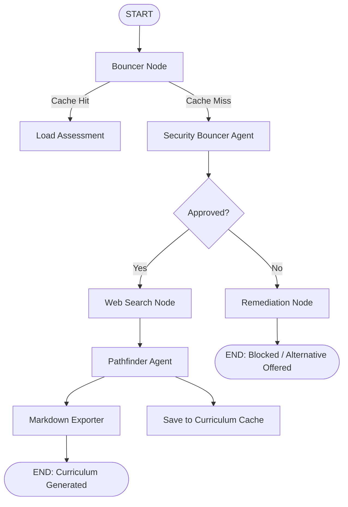
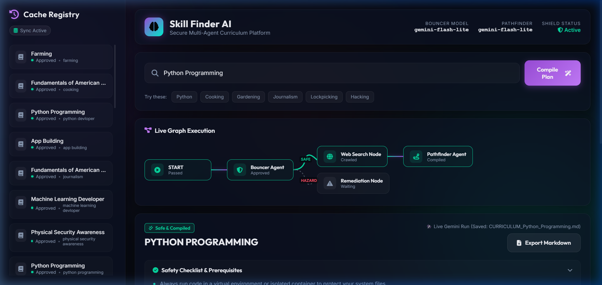

# 🤖 Skill Finder AI: Curriculum Platform Documentation

Skill Finder AI is a secure, multi-agent curriculum generator built on the **Google Agent Development Kit (ADK)** and powered by **Gemini**. It enables developers and students to securely request a 4-week structured curriculum for any skill, dynamically retrieves educational resources, evaluates safety policies, caches runs, and compiles results into user-friendly Markdown files.

---

## 🏗️ System Architecture

The application is designed as a directed acyclic graph (DAG) workflow with shift-left security enforcement.



---

## 🌟 Core Features

### 1. Shift-Left Security (Security Bouncer Agent)
*   **Prompt Injection Protection**: Detects and intercepts jailbreaks, system prompt extractions, or privilege escalation requests.
*   **Hazardous Skill Gate**: Blocks unsafe queries (offensive cyberattacks, weaponry construction, high-voltage maintenance, lockpicking).
*   **Autonomous Steering**: Redirects blocked inputs to educational alternatives (e.g., *Lockpicking* $\rightarrow$ *Physical Security Awareness*; *Hacking* $\rightarrow$ *Cybersecurity Fundamentals*).

### 2. Pathfinder Agent
*   Builds a structured **4-week learning curriculum** based on the query and search results.
*   Enforces standard objectives (Week 1: Foundations, Week 2: Guided Practice, Week 3: Applied Simulation, Week 4: Capstone Project).
*   Organizes weekly activities, hands-on practice labs, and references.

### 3. Integrated Resource Searching
*   Integrates customized web search stubs that crawl, extract, and recommend safe, relevant web resources (documentations, courses, video tutorials) tailored to the target skill.

### 4. Smart Cache Management
*   **Safety Cache (`cache.json`)**: Saves raw bouncer safety assessments to instantly resolve redundant safety check runs.
*   **Curriculum Cache (`curriculum_cache.json`)**: Caches complete pathfinder outputs mapped to the user query.
*   **Workspace File Sync**:
    *   **Skip-on-Exist**: Checks if `CURRICULUM_<skill>.md` already exists in your workspace root. If so, skips executing the workflow entirely.
    *   **Auto-Restore**: If the `.md` file is missing but cached in the database, it recreates the Markdown file in milliseconds without querying the live Gemini API.

### 5. Beautiful Markdown Exporter
*   Compiles structured schema parameters into a clean, presentation-ready Markdown file loaded with emojis, lists, checklists, and hyperlinks in the workspace root.

### 6. Dedicated Interactive Front-End UI
*   A responsive, glassmorphic custom web interface built with modern vanilla CSS and JavaScript.
*   Allows real-time skill curriculum generation with a live compiling state.
*   Displays instant results from the Security Bouncer (including recommended alternatives if blocked) and renders the Markdown output directly in the browser.

---

## 🖼️ Project Showcase

Below is a screenshot of the custom front-end interface showing a successfully generated curriculum for the "Python Programming" skill:



---

## 📁 Directory Structure

```text
Capstone-Project/
│
├── .agents/                        # Core Agent Implementation Directory
│   ├── skills/                     # Custom Agent Skills
│   │   └── web_search/             # Resource search mapping & scraper stubs
│   ├── tests/                      # Core agent unit tests
│   ├── cache.json                  # Persistent safety assessment cache
│   ├── curriculum_cache.json       # Persistent full-curriculum cache
│   ├── graph.py                    # Graph DAG nodes, edges, and routing logic
│   ├── pathfinder.py               # Pathfinder agent configuration
│   ├── run_local.py                # Command-line execution runner & exporter
│   ├── schemas.py                  # Pydantic state/output serialization schemas
│   └── security_bouncer.py         # Bouncer agent instructions & callbacks
│
├── app/                            # ADK Deployment & Playground Template
│   ├── .adk/                       # Web UI sessions and local logs database
│   ├── .env                        # Local app-level credentials
│   ├── agent.py                    # Web UI agent wrapper (scrubs env conflicts)
│   └── agent_runtime_app.py        # Cloud-deployable runtime configuration
│
├── tests/                          # Root Integration Tests
│   ├── integration/                # SSE stream & web runtime validation tests
│   ├── unit/                       # Unit test stubs
│   └── conftest.py                 # Mocking client, auth, and LLM registry for offline speed
│
├── web/                            # Custom Front-End Web Application
│   ├── server.py                   # FastAPI server serving API and web assets
│   └── static/                     # Web assets (index.html, style.css, app.js)
│
├── .env                            # Workspace-level environment variables
├── pyproject.toml                  # Python package and dependency configuration
└── README.md                       # High-level running guide
```

---

## 🚀 Execution Guide

### Prerequisite Environment Configuration
Make sure your `.env` contains the correct API key:
```env
export GEMINI_API_KEY="your_gemini_api_key_here"
export GOOGLE_GENAI_USE_ENTERPRISE=FALSE
```

### 1. Run via Command Line (CLI)
To run the local curriculum builder:
```bash
uv run python .agents/run_local.py cooking
```
This runs the bouncer safety check, calls pathfinder, writes outputs to the terminal, and creates **`CURRICULUM_Basic_Culinary_Arts.md`** in your root directory.

### 2. Run via ADK Dev Playground (Web UI)
Launch the local ADK developer server:
```bash
uv run adk web . --port 8080
```
Navigate to:
[http://127.0.0.1:8080/dev-ui/?app=app](http://127.0.0.1:8080/dev-ui/?app=app)
Here, you can enter queries interactively, inspect active sessions, and review step-by-step debugging traces.

### 3. Run via Custom Web Application (Front End)
Launch the custom FastAPI server:
```bash
uv run python web/server.py
```
Open your browser and navigate to:
[http://127.0.0.1:8000/](http://127.0.0.1:8000/)

### 4. Run Test Suites (Offline-Mocked)
All tests are configured to run mocked so they execute instantly without querying the internet:
```bash
uv run python -m pytest
```
Outputs:
```text
tests\integration\test_agent.py .                                        [ 25%]
tests\integration\test_agent_runtime_app.py ..                           [ 75%]
tests\unit\test_dummy.py .                                               [100%]
======================= 4 passed in 0.85s ========================
```
